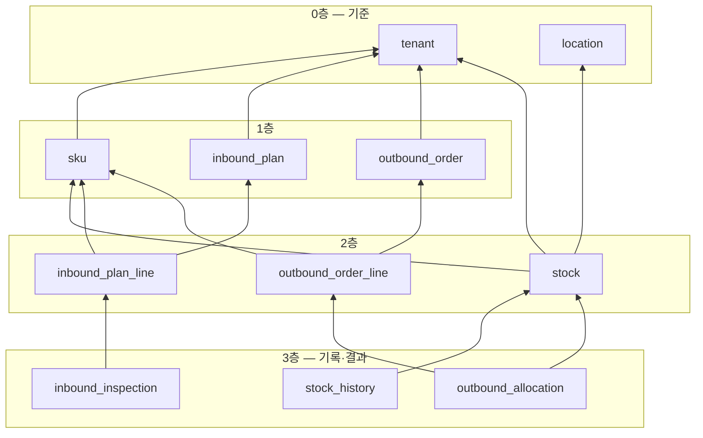

> 상위: [[KDT_1차 정규프로젝트 MOC]]

# WMS 주말 MVP 명세 — 입고부터 출고까지 백엔드 한 바퀴

> ⚠ **이 문서(v1, 3PL 화주 기준)는 `WMS/주말_MVP_명세_v2.md`(단일 WMS)로 대체됐다.** 화주 도입 이후 참고용으로만 남긴다.


> 기간: 9/19(토) ~ 9/20(일) · 대상: **WMS Core 백엔드만** (Portal, 화면, MQ 제외)
> 완료 판정: §7의 Talend API Tester 시나리오 12단계가 처음부터 끝까지 통과한다
> 기준 문서: `WMS/설계서_v2.md`. 이 문서는 그중 주말에 만들 부분만 잘라낸 것이다
> 첨부: `V1__init_schema.sql`, `V2__seed_master.sql` (MySQL 8.0.46에서 실행 확인)

---

## 1. 먼저 알아야 할 도메인 지식

### 1.1 한 줄 요약

**3PL 물류센터**는 여러 회사(화주)의 상품을 대신 보관하고, 화주가 "어디로 몇 개 보내라"고 하면 대신 출고해 주는 창고다. 우리는 이 창고에서 쓰는 시스템(WMS)을 만든다.

### 1.2 용어

| 용어 | 영문 (코드) | 뜻 | 헷갈리기 쉬운 점 |
|---|---|---|---|
| 화주 | tenant | 창고에 물건을 맡긴 회사. A(건기식), B(음료), C(가공식품) 3곳 | 거래처·고객이 아니다. 우리 시스템의 "손님 회사" |
| SKU | sku | 재고를 세는 최소 상품 단위. 규격이 다르면 다른 SKU | 생수 500ml 20입 박스와 2L 6입 박스는 다른 SKU |
| 소비기한 | expiry date (`expiry_date`) | 먹어도 되는 마지막 날 | 2023년부터 식품 표시가 "유통기한"에서 "소비기한"으로 바뀌었다. 코드·화면 모두 **소비기한**으로 통일한다 |
| 로케이션 | location | 창고 안의 칸 주소. `S1-01-03-2` | 창고 전체가 아니라 선반의 한 칸 |
| 입고예정 | inbound plan | "언제 무엇이 몇 개 올 예정"이라는 사전 통보 | 아직 물건은 창고에 없다 |
| 검수 | inspection | 도착한 물건을 세고 상태·소비기한을 확인하는 일 | 예정 100개가 와도 실제로는 95개일 수 있다 |
| 입고확정 | confirm | 검수 결과를 고정하고 창고 재고로 인정하는 순간 | 이때 재고가 생기지만 아직 **입고 도크(RCV)**에 있다 |
| 적치 | putaway | 도크의 물건을 보관 선반(로케이션)에 올리는 일 | **적치해야 출고할 수 있는 재고(가용)가 된다** |
| 실물재고 | on hand (`on_hand_qty`) | 지금 그 칸에 실제로 있는 수량 | |
| 선점재고 | allocated (`allocated_qty`) | 출고하기로 찜해 둔 수량 | 아직 칸에 있지만 다른 주문이 쓰면 안 된다 |
| 가용재고 | available (`available_qty`) | 실물 − 선점. 새 주문이 쓸 수 있는 수량 | 직접 저장하지 않고 계산한다 |
| 출고요청 | outbound order | 화주가 "어디로 몇 개 보내라"는 요청 | 주문(order)이라고 부르지 않는다 |
| 할당 | allocate | 출고요청을 어느 칸의 어느 재고로 채울지 정하고 선점하는 일 | 할당해도 실물은 줄지 않는다 |
| FEFO | First Expired, First Out | 소비기한이 **빠른** 재고부터 출고 | FIFO(먼저 입고된 것부터)와 다르다. 늦게 들어왔어도 기한이 빠르면 먼저 나간다 |
| 분할할당 | split allocation | 한 칸으로 부족하면 여러 칸에서 나눠 채움 | |
| 피킹 | picking | 작업자가 할당된 칸에 가서 물건을 집는 일 | |
| 결품 | shortage | 시스템상 있어야 할 물건이 칸에 없음 | 주말 MVP에서는 다루지 않는다 (2주차) |
| 출고확정 | confirm shipment | 물건이 창고를 떠남. **실물재고가 줄어드는 유일한 순간** | |
| 재고이력 | stock history | 재고 수량이 바뀔 때마다 남기는 한 줄 기록 | 수량 변경과 **같은 트랜잭션**에서 남긴다 |

### 1.3 재고가 움직이는 모습 (주말 시나리오 그대로)

B화주 생수(BEV-0001) 100박스 입고예정 → 정상 95(기한 2종) + 파손 5 → 50박스 출고

| 단계 | RCV-01 | S1-01-02-1 (기한 2027-01-31) | S1-01-01-1 (기한 2027-03-31) | 이력 |
|---|---|---|---|---|
| 입고확정 | 실물 95 (35 + 60) | | | INBOUND ×2 |
| 적치 | 0 | 실물 35 / 선점 0 / **가용 35** | 실물 60 / 선점 0 / **가용 60** | PUTAWAY_OUT ×2, PUTAWAY_IN ×2 |
| 50박스 할당 (FEFO) | | 실물 35 / 선점 35 / 가용 0 | 실물 60 / 선점 15 / 가용 45 | ALLOCATE ×2 |
| 피킹 | (변화 없음) | | | 없음 |
| 출고확정 | | 실물 0 / 선점 0 | 실물 45 / 선점 0 / 가용 45 | OUTBOUND ×2 |

FEFO 때문에 로케이션 코드가 뒤인 `S1-01-02-1`(기한이 더 빠름)에서 먼저 35박스를 잡는다는 점이 핵심이다.

---

## 2. 이름 규칙

### 2.1 코드 체계

| 대상 | 형식 | 예 | 규칙 |
|---|---|---|---|
| 화주코드 | 영문 대문자 3자리 | `HLT` `BEV` `FOD` | 시드 고정. 바꾸지 않는다 |
| SKU코드 | `{화주코드}-{4자리 일련번호}` | `BEV-0001` | 화주가 바뀌지 않으므로 코드에 화주를 넣는다. 분류·규격은 코드에 넣지 않는다(바뀔 수 있어서) |
| 보관 로케이션 | `S{구역}-{통로2}-{베이2}-{단1}` | `S1-01-03-2` | 구역 S1~S3, 통로 01~04, 베이 01~10, 단 1~3(1=바닥). 0을 채웠으므로 **문자열 정렬 = 피킹 순서** |
| 입고 도크 | `RCV-{2자리}` | `RCV-01` | 주말에는 `RCV-01`만 쓴다 |
| 입고예정번호 | `IB-{yyyyMMdd}-{3자리}` | `IB-20260919-001` | 창고 전체에서 그날의 일련번호 |
| 출고요청번호 | `OB-{yyyyMMdd}-{3자리}` | `OB-20260919-001` | 위와 동일 |
| 사용자 아이디 | 운영자 `admin`, 작업자 `worker01`… | | |

> 번호는 주말에는 "오늘자 마지막 번호 + 1"로 만든다. 동시에 두 건이 등록되면 같은 번호가 나올 수 있는데 UNIQUE 제약이 막아 준다(한쪽이 실패). 채번 방식은 2주차 결정로그 대상이다.

**로케이션 코드 읽는 법**
```
S1-01-03-2
│  │  │  └ 단 2 (아래에서 두 번째 칸)
│  │  └──── 베이 03 (통로 안의 세 번째 칸)
│  └─────── 통로 01
└────────── 구역 S1
```

### 2.2 시드 데이터 (V2에 들어 있음)

| 화주 id | 코드 | 품목군 | 출고허용 잔여일 | SKU id | SKU |
|---|---|---|---|---|---|
| 1 | HLT | 건강기능식품 | 180 | 1~5 | HLT-0001 종합비타민 ~ HLT-0005 루테인 (EA) |
| 2 | BEV | 음료 | 60 | 6~10 | BEV-0001 생수 ~ BEV-0005 보리차 (BOX) |
| 3 | FOD | 상온 가공식품 | 90 | 11~15 | FOD-0001 컵라면 ~ FOD-0005 3분 카레 (BOX) |

로케이션 id: `RCV-01`=1, `RCV-02`=2, `S1-01-01-1`=3 … `S3-04-10-3`=362 (코드 순서대로)

### 2.3 상태값 (enum, 전부 `@Enumerated(EnumType.STRING)`)

| enum | 값 | 주말에 쓰는 것 |
|---|---|---|
| `InboundPlanStatus` | `REGISTERED` `INSPECTING` `CONFIRMED` `COMPLETED` `CANCELED` | 전부 |
| `OutboundOrderStatus` | `RECEIVED` `ALLOCATED` `ALLOCATION_FAILED` `PICKING` `PICKED` `SHIPPED` `PARTIALLY_SHIPPED` `UNSHIPPED` `CANCELED` | `PARTIALLY_SHIPPED` `UNSHIPPED` `CANCELED` 제외 |
| `AllocationStatus` | `ALLOCATED` `PICKED` `SHORT` `CANCELED` | `ALLOCATED` `PICKED` |
| `LocationType` | `STORAGE` `RECEIVING` | 전부 |
| `StockTxType` | `INBOUND` `PUTAWAY_OUT` `PUTAWAY_IN` `ALLOCATE` `DEALLOCATE` `SHORTAGE` `OUTBOUND` `ADJUST` | 앞의 4개 + `OUTBOUND` |
| `RefType` | `INBOUND_PLAN` `OUTBOUND_ORDER` `ADJUSTMENT` | 앞의 2개 |
| `RejectReason` | `DAMAGED` `EXPIRY_SHORT` | 전부 |
| `Source` | `WMS` `PORTAL` | `WMS` |

---

## 3. 1차 ERD (WMS Core)

**참조 방향 규칙 [결정]**: 외래키(FK)는 항상 **자식(N) → 부모(1)** 한 방향만 건다. 부모는 자식을 참조하지 않는다. 그래서 두 테이블이 서로를 가리키는 양방향 참조도, A → B → … → A로 돌아오는 순환 참조도 없다. 아래 그림에서 화살표는 "참조한다"는 뜻이고, 모든 화살표가 아래층에서 위층으로만 향한다.



| 층 | 테이블 | 참조하는 대상 (FK) |
|---|---|---|
| 0 | `tenant`, `location` | 없음 |
| 1 | `sku`, `inbound_plan`, `outbound_order` | tenant |
| 2 | `stock` | tenant, sku, location |
| 2 | `inbound_plan_line` / `outbound_order_line` | inbound_plan 또는 outbound_order, sku |
| 3 | `stock_history` | stock |
| 3 | `inbound_inspection` | inbound_plan_line |
| 3 | `outbound_allocation` | outbound_order_line, stock |

실제 MySQL에 V1을 실행한 뒤 `information_schema`에서 FK 14개를 뽑아 검사했다. 양방향 0건, 순환 0건.

**순환을 막기 위해 일부러 FK를 걸지 않은 곳**

| 컬럼 | FK를 안 건 이유 |
|---|---|
| `stock_history.ref_type` / `ref_id` | 입고·출고가 재고를 참조하는데(입고 → 재고), 재고 이력이 다시 입고·출고를 참조하면(재고 → 입고) **도메인끼리 순환**이 생긴다. 그래서 이력은 "어떤 문서 몇 번"을 값으로만 적는다 |
| `stock_history.tenant_id` / `sku_id` / `location_id` / `expiry_date` | 조회 필터용 복사값이다. 원본은 `stock_id`를 따라가면 나온다. FK를 또 걸면 같은 부모로 가는 길이 두 개가 된다 |

- `outbound_allocation`에 있던 `location_id`, `expiry_date` 복사 컬럼은 **삭제했다**. `stock` 한 행의 로케이션·소비기한은 바뀌지 않으므로 `stock`을 조인하면 된다. 같은 정보로 가는 길을 하나로 둔다.
- 코드도 같은 방향을 따른다: 엔티티는 FK를 가진 쪽만 `@ManyToOne`을 갖고, 부모에는 `@OneToMany`를 두지 않는다(§5-3). 패키지 의존도 `inbound → stock`, `outbound → stock` 한 방향이고, `stock` 패키지는 `inbound`·`outbound`를 import하지 않는다.

| 테이블 | 한 행의 의미 | 핵심 컬럼 | 핵심 제약 |
|---|---|---|---|
| `tenant` | 화주 1곳 | tenant_code, 출고·입고허용 잔여일 | code UNIQUE |
| `app_user` | WMS 사용자 1명 | username, password, role | username UNIQUE |
| `sku` | 상품 1종 | tenant_id, sku_code, base_unit | sku_code UNIQUE |
| `location` | 창고 칸 1개 | location_code, location_type, 구역·통로·베이·단 | code UNIQUE |
| `stock` | (화주, SKU, 칸, 소비기한) 조합의 수량 | on_hand_qty, allocated_qty, available_qty(생성 컬럼) | UNIQUE(tenant, sku, location, expiry), **CHECK(0 ≤ 선점 ≤ 실물)** |
| `stock_history` | 재고 변동 1건 | tx_type, 증감량, 변경 후 수량, ref_type/ref_id | 추가만 함 |
| `inbound_plan` | 입고예정 1건 | inbound_no, status | inbound_no UNIQUE |
| `inbound_plan_line` | 입고예정의 SKU 1줄 | sku_id, expected_qty | expected_qty > 0 |
| `inbound_inspection` | 한 줄 안의 소비기한별 검수 결과 | expiry_date, good_qty, reject_qty, putaway_qty | 0 ≤ 적치 ≤ 정상 |
| `outbound_order` | 출고요청 1건 | outbound_no, ship_to, status | outbound_no UNIQUE |
| `outbound_order_line` | 출고요청의 SKU 1줄 | requested_qty, allocated_qty, shipped_qty | requested_qty > 0 |
| `outbound_allocation` | 한 줄을 어느 재고 행에서 몇 개 가져올지 | stock_id, allocated_qty, picked_qty, status (로케이션·소비기한은 stock 조인) | allocated_qty > 0 |

전체 DDL은 첨부한 `V1__init_schema.sql`, 시드는 `V2__seed_master.sql`에 있다. 설계서 v2의 `outbox_event`, `processed_message`, `inspection_upload`는 2주차 이후에 추가한다(V3 이후).

---

## 4. 주말에 만들 API

- 공통: `/api/v1` 접두, 팀 공통 응답 래퍼, 에러 코드 `{도메인}_{3자리}`
- **주말에는 인증 없이 전부 열어 둔다**(Spring Security `permitAll`). 그래야 Talend에서 토큰 없이 바로 호출할 수 있다. 로그인 API는 만들되 월요일에 적용한다
- 요청에는 id 대신 **코드**(`skuCode`, `locationCode`)를 받는다. Talend에서 손으로 입력하기 쉽다. 서비스에서 `findBySkuCode`로 찾는다

| # | 기능 | 메서드 | URL | 담당 |
|---|---|---|---|---|
| A1 | 화주 목록 | GET | `/tenants` | ② |
| A2 | SKU 목록 | GET | `/skus?tenantId=` | ② |
| A3 | 로케이션 목록 | GET | `/locations?type=&zone=` | ② |
| B1 | 입고예정 등록 | POST | `/inbound-plans` | ④ |
| B2 | 입고예정 목록 | GET | `/inbound-plans?tenantId=&status=` | ④ |
| B3 | 입고예정 상세 (라인, 검수 행 포함) | GET | `/inbound-plans/{id}` | ④ |
| B4 | 입고예정 취소 | PATCH | `/inbound-plans/{id}/cancel` | ④ |
| B5 | 검수 저장 (전체 교체) | PUT | `/inbound-plans/{id}/inspections` | ④ |
| B6 | 입고확정 | PATCH | `/inbound-plans/{id}/confirm` | ④ |
| B7 | 적치 | POST | `/inbound-plans/{id}/putaways` | ④ (막히면 ③) |
| C1 | 재고 목록 (행 단위) | GET | `/stocks?tenantId=&skuCode=&locationCode=` | ③ |
| C2 | 재고 요약 (SKU별, STORAGE만) | GET | `/stocks/summary?tenantId=` | ③ |
| C3 | 재고이력 | GET | `/stock-histories?tenantId=&skuCode=` | ③ |
| D1 | 출고요청 등록 | POST | `/outbound-orders` | ① |
| D2 | 출고요청 목록 | GET | `/outbound-orders?tenantId=&status=` | ① |
| D3 | 출고요청 상세 (라인, 할당 포함) | GET | `/outbound-orders/{id}` | ① |
| D4 | 할당 실행 (FEFO) | PATCH | `/outbound-orders/{id}/allocate` | ① |
| D5 | 피킹 시작 | PATCH | `/outbound-orders/{id}/start-picking` | ① |
| D6 | 피킹수량 입력 | PATCH | `/outbound-allocations/{id}/pick` | ① |
| D7 | 출고확정 | PATCH | `/outbound-orders/{id}/confirm-shipment` | ① |
| E1 | 로그인 (만들기만, 적용은 월요일) | POST | `/auth/login` | ③ |

### 4.1 재고를 바꾸는 창구: `StockService` (③ 소유)

**재고 테이블을 바꾸는 코드는 여기에만 있다.** ④와 ①은 이 메서드만 호출한다.

```java
public interface StockService {
    // 입고확정: RCV 로케이션에 재고 생성(또는 합산) + INBOUND 이력
    void receive(Long tenantId, Long skuId, LocalDate expiryDate, int qty, Long inboundPlanId);

    // 적치: RCV에서 빼서 STORAGE에 넣음 + PUTAWAY_OUT / PUTAWAY_IN 이력
    void putaway(Long tenantId, Long skuId, LocalDate expiryDate, Long toLocationId, int qty, Long inboundPlanId);

    // FEFO 후보 조회 (주말: 락 없음 / 2주차: FOR UPDATE 추가)
    List<Stock> findAllocatable(Long tenantId, Long skuId, LocalDate minExpiryDate);

    // 선점 + ALLOCATE 이력
    void allocate(Long stockId, int qty, Long outboundOrderId);

    // 출고: 실물·선점 동시 차감 + OUTBOUND 이력
    void ship(Long stockId, int qty, Long outboundOrderId);
}
```

**토요일 오전에 ③이 이 인터페이스와 빈 구현을 먼저 push한다.** ④와 ①은 이걸 호출하는 코드를 바로 쓸 수 있다.

FEFO 후보 조회 JPQL (③):
```java
@Query("""
    select s from Stock s
      join s.location l
     where s.tenantId = :tenantId
       and s.sku.id = :skuId
       and l.locationType = com.xxx.LocationType.STORAGE
       and s.availableQty > 0
       and s.expiryDate >= :minExpiryDate
     order by s.expiryDate asc, l.locationCode asc
    """)
List<Stock> findAllocatable(Long tenantId, Long skuId, LocalDate minExpiryDate);
```
`minExpiryDate = 오늘 + 출고허용 잔여일`(SKU 값이 있으면 SKU 값, 없으면 화주 값).

### 4.2 주말 검증 규칙 (이것만 한다)

| API | 실패 조건 | 응답 |
|---|---|---|
| B1 입고예정 등록 | 라인 0개 / 수량 ≤ 0 | 400 |
| | 없는 SKU | 400 `SKU_001` |
| | 다른 화주의 SKU | 400 `TENANT_001` |
| B5 검수 저장 | 상태가 `REGISTERED`/`INSPECTING`이 아님 | 409 `INBOUND_002` |
| | 라인별 (정상 + 불량) 합 > 예정수량 | 400 `INBOUND_001` |
| | 소비기한이 오늘 이전 | 400 `INBOUND_004` |
| | 불량수량 > 0인데 사유 없음 | 400 |
| B6 입고확정 | 상태가 `INSPECTING`이 아님 | 409 `INBOUND_002` |
| B7 적치 | 상태가 `CONFIRMED`가 아님 | 409 |
| | 적치수량 > (정상 − 이미 적치한 수량) | 400 `INBOUND_005` |
| | 로케이션이 STORAGE가 아님 | 400 |
| B4 취소 | 상태가 `REGISTERED`가 아님 | 409 |
| D1 출고요청 등록 | B1과 같음 | |
| D4 할당 | 상태가 `RECEIVED`/`ALLOCATION_FAILED`가 아님 | 409 `OUTBOUND_001` |
| | 가용 부족 | **200**, 상태 `ALLOCATION_FAILED`, `failReason`에 부족 SKU·수량. 선점 0 |
| D5 피킹 시작 | 상태가 `ALLOCATED`가 아님 | 409 |
| D6 피킹 입력 | 주문이 `PICKING`이 아님 | 409 |
| | **주말 한정**: 피킹수량 ≠ 할당수량 | 400 "결품 처리는 2주차에 지원" |
| D7 출고확정 | 상태가 `PICKED`가 아님 | 409 |

주말에 **하지 않는 것**: 혼적 규칙, 입고허용 잔여일, 결품·부분출고, 출고 취소 원복, 동시성 락, 인증 적용.

---

## 5. 기초 JPA 외에 주말 전에 알아야 할 것 (전원 필독)

기초 JPA(Entity, DTO `from`/`toEntity`, Repository, `@Transactional`)로 대부분 만들 수 있다. 아래 여섯 가지만 추가로 알고 시작한다. 모두 30분 안에 익힐 수 있다.

**1. 수정은 `toEntity()`가 아니라 "찾아서 → 엔티티 메서드 호출"**

```java
// 엔티티
public void confirm() {
    if (status != InboundPlanStatus.INSPECTING) throw new BusinessException(ErrorCode.INBOUND_002);
    this.status = InboundPlanStatus.CONFIRMED;
    this.confirmedAt = LocalDateTime.now();
}
// 서비스
@Transactional
public void confirm(Long id) {
    InboundPlan plan = inboundPlanRepository.findById(id).orElseThrow(...);
    plan.confirm();          // save() 호출 안 해도 트랜잭션이 끝날 때 UPDATE (변경 감지)
}
```
`@Setter`는 쓰지 않는다. 상태를 바꾸는 규칙이 엔티티 메서드 안에 있어야 한다.

**2. `toEntity()`는 헤더만. SKU 같은 다른 테이블 조회는 서비스에서**

DTO는 Repository를 모른다. `skuRepository.findBySkuCode()`로 찾아서 엔티티에 넘긴다.

**3. 연관관계는 `@ManyToOne` 단방향만 쓴다 (주말 한정)**

`InboundPlanLine`이 `@ManyToOne InboundPlan`을 갖고, 부모에는 `@OneToMany`를 두지 않는다. 부모를 먼저 `save()`하고 자식을 각자 Repository로 `save()`한다. 상세 조회는 `lineRepository.findByInboundPlanId(id)`. cascade와 양방향은 2주차에 필요하면 배운다.

**4. enum은 반드시 `@Enumerated(EnumType.STRING)`**

기본값(ORDINAL)은 숫자로 저장돼서 enum 순서를 바꾸면 데이터가 뒤바뀐다.

**5. 생성 컬럼 `available_qty` 매핑**

```java
@Column(insertable = false, updatable = false)
private int availableQty;   // 조회 쿼리용. DB가 계산한다

public int available() {    // 자바 코드에서는 이걸 쓴다
    return onHandQty - allocatedQty;
}
```
같은 트랜잭션에서 선점을 바꾼 직후에는 `availableQty` 필드가 옛 값이다. 코드 안에서는 항상 `available()`을 쓴다.

**6. 여러 테이블을 바꾸는 서비스 메서드에는 `@Transactional`**

입고확정은 `inbound_plan`, `stock`, `stock_history`를 함께 바꾼다. 중간에 예외가 나면 전부 롤백돼야 한다. 컨트롤러가 아니라 **서비스 메서드**에 붙인다.

### 주말에 배우지 않아도 되는 것 (2주차 이후)

| 주제 | 언제 | 누가 |
|---|---|---|
| 비관적 락 (`@Lock`, `FOR UPDATE`), 조건부 UPDATE (`@Modifying`) | 2주차 | ③ |
| 동시성 테스트 (`ExecutorService`, `CountDownLatch`), Testcontainers | 2주차 | ③, ② |
| `@OneToMany` cascade·orphanRemoval, fetch join (N+1) | 필요할 때 | 전원 |
| Spring Security JWT 필터 적용 | 월요일 | ③ |
| RabbitMQ, Outbox, 멀티 DataSource 라우팅 | 2주차 | ② |
| Excel (Apache POI) | 3주차 | ④ |

---

## 6. 담당별 주말 할 일

### 금요일 밤 ~ 토요일 오전 (선행 작업, 이게 끝나야 시작)

| 담당 | 할 일 | 끝나는 시점 |
|---|---|---|
| ② | 뼈대 리포(`core` 모듈), docker-compose(MySQL), Flyway에 V1·V2 넣기, 공통 응답·예외 핸들러, Swagger, `permitAll` 보안 설정, `DataInitializer`(admin / worker01 생성) | 토 오전 10시 |
| ③ | `Stock`, `StockHistory` 엔티티 + `StockService` 인터페이스와 빈 구현 push | 토 오전 11시 |
| 전원 | clone → 실행 → Swagger 열림 → `GET /tenants` 확인 | 토 오전 11시 |

### 토·일

| 담당 | 만들 것 | 완료 기준 (Talend 시나리오 단계) |
|---|---|---|
| **④ 입고** | B1~B7. 엔티티 `InboundPlan`, `InboundPlanLine`, `InboundInspection` | 1~5단계 통과 |
| **③ 재고** | `StockService` 구현 5개 메서드, C1~C3, E1 | 6단계 + 12단계 통과, 이력 합계 = 현재고 |
| **① 출고** | D1~D7, `FefoAllocationPlanner`(DB 없이 도는 순수 자바 클래스) + 단위 테스트 | 7~11단계 통과 |
| **② 나** | A1~A3, 통합 병합 담당. 남는 시간에 Portal 라우팅 뼈대 | 일요일 저녁 전체 시나리오 1회 통과 |

- **①은 ④를 기다리지 않는다.** 토요일에는 재고를 SQL로 직접 넣고 할당을 개발한다.

```sql
INSERT INTO stock (tenant_id, sku_id, location_id, expiry_date, on_hand_qty, allocated_qty, created_at, updated_at) VALUES
(2, 6, 6, '2027-01-31', 35, 0, NOW(), NOW()),   -- S1-01-02-1
(2, 6, 3, '2027-03-31', 60, 0, NOW(), NOW());   -- S1-01-01-1
```
- **④는 적치(B7)를 일요일 12시까지 못 끝내면 ③에게 넘긴다.** 등록부터 확정까지가 ④의 필수 범위다.
- 병합 순서 (일요일 18시): ② → ③ → ④ → ①. 병합 후 §7 시나리오를 한 번 처음부터 돌린다.

### `FefoAllocationPlanner` (①) 뼈대

```java
public AllocationPlan plan(List<Stock> candidates, int requestedQty) {
    List<AllocationPlan.Item> items = new ArrayList<>();
    int remaining = requestedQty;
    for (Stock s : candidates) {                 // 이미 소비기한·로케이션 순으로 정렬돼 있음
        if (remaining == 0) break;
        int take = Math.min(s.available(), remaining);
        if (take > 0) {
            items.add(new AllocationPlan.Item(s.getId(), take));
            remaining -= take;
        }
    }
    return remaining == 0 ? AllocationPlan.success(items) : AllocationPlan.shortage(requestedQty - remaining);
}
```
여러 라인 중 하나라도 `shortage`면 아무것도 선점하지 않고 `ALLOCATION_FAILED`로 바꾼다(전부 아니면 전무). 라인은 `skuId` 오름차순으로 처리한다(2주차 락 순서 대비).

---

## 7. Talend API Tester 시나리오 (완료 판정)

`Content-Type: application/json`, 기본 URL `http://localhost:8080/api/v1`. 날짜는 9/19 실행 기준 예시다.

| # | 요청 | 본문 | 기대 결과 |
|---|---|---|---|
| 1 | `POST /inbound-plans` | ① | 201, `inboundNo: "IB-20260919-001"`, `status: REGISTERED` |
| 2 | `PUT /inbound-plans/1/inspections` | ② | 200, `status: INSPECTING` |
| 3 | `PATCH /inbound-plans/1/confirm` | — | 200, `CONFIRMED`. `GET /stocks?tenantId=2`에 RCV-01 행 2개(35, 60) |
| 4 | `POST /inbound-plans/1/putaways` | ③ | 200, `COMPLETED` |
| 5 | `GET /stocks?tenantId=2&skuCode=BEV-0001` | — | RCV-01 두 행 실물 0, S1-01-02-1 35, S1-01-01-1 60 |
| 6 | `GET /stocks/summary?tenantId=2` | — | BEV-0001 실물 95 / 선점 0 / 가용 95 |
| 7 | `POST /outbound-orders` | ④ | 201, `outboundNo: "OB-20260919-001"`, `RECEIVED` |
| 8 | `PATCH /outbound-orders/1/allocate` | — | `ALLOCATED`. 할당 2건: **S1-01-02-1 35 → S1-01-01-1 15** (소비기한 빠른 순) |
| 9 | `PATCH /outbound-orders/1/start-picking` | — | `PICKING` |
| 10 | `PATCH /outbound-allocations/1/pick`, `/2/pick` | `{"pickedQty":35}`, `{"pickedQty":15}` | 두 번째 호출 후 주문 `PICKED` |
| 11 | `PATCH /outbound-orders/1/confirm-shipment` | — | `SHIPPED`. 요약 BEV-0001 실물 45 / 선점 0 / 가용 45 |
| 12 | `GET /stock-histories?tenantId=2&skuCode=BEV-0001` | — | 10건: INBOUND 2, PUTAWAY_OUT 2, PUTAWAY_IN 2, ALLOCATE 2, OUTBOUND 2. 실물 증감 합계 = 45 |

**본문**

```json
// ① 입고예정 등록
{ "tenantId": 2, "expectedDate": "2026-09-21", "remark": "정기 입고",
  "lines": [ { "skuCode": "BEV-0001", "expectedQty": 100 } ] }

// ② 검수 저장 (lineId는 1단계 응답에서 확인)
{ "rows": [
    { "lineId": 1, "expiryDate": "2027-03-31", "goodQty": 60, "rejectQty": 0 },
    { "lineId": 1, "expiryDate": "2027-01-31", "goodQty": 35, "rejectQty": 5, "rejectReason": "DAMAGED" }
] }

// ③ 적치 (inspectionId는 2단계 응답에서 확인)
{ "rows": [
    { "inspectionId": 1, "locationCode": "S1-01-01-1", "qty": 60 },
    { "inspectionId": 2, "locationCode": "S1-01-02-1", "qty": 35 }
] }

// ④ 출고요청 등록
{ "tenantId": 2, "shipToName": "한빛마트 강남점", "shipToAddress": "서울시 강남구 테헤란로 1",
  "requestedShipDate": "2026-09-22",
  "lines": [ { "skuCode": "BEV-0001", "requestedQty": 50 } ] }
```

**실패 확인 (여유 있으면)**

| # | 요청 | 기대 결과 |
|---|---|---|
| F1 | 1번 본문에서 `tenantId: 1`(A화주)로 등록 | 400 `TENANT_001` (BEV-0001은 B화주 SKU) |
| F2 | 2번 본문의 60을 70으로 (합계 110 > 100) | 400 `INBOUND_001` |
| F3 | 출고요청 200박스 → 할당 | 200, `ALLOCATION_FAILED`, 선점 변화 없음 |
| F4 | 확정된 출고요청에 다시 할당 | 409 `OUTBOUND_001` |

---

## 8. 일요일 밤 체크리스트

- [ ] §7의 1~12단계가 새 DB에서 처음부터 끝까지 통과한다
- [ ] 12단계의 이력 증감 합계가 5·11단계의 현재 수량과 같다
- [ ] `stock` 테이블을 UPDATE하는 코드가 `StockService` 밖에 없다 (`grep`으로 확인)
- [ ] 모든 enum이 `EnumType.STRING`이다
- [ ] 각자 브랜치를 develop에 병합했다
- [ ] 월요일 구두 설명: 각자 "내 API가 재고를 어떻게 바꾸는지" 1분
