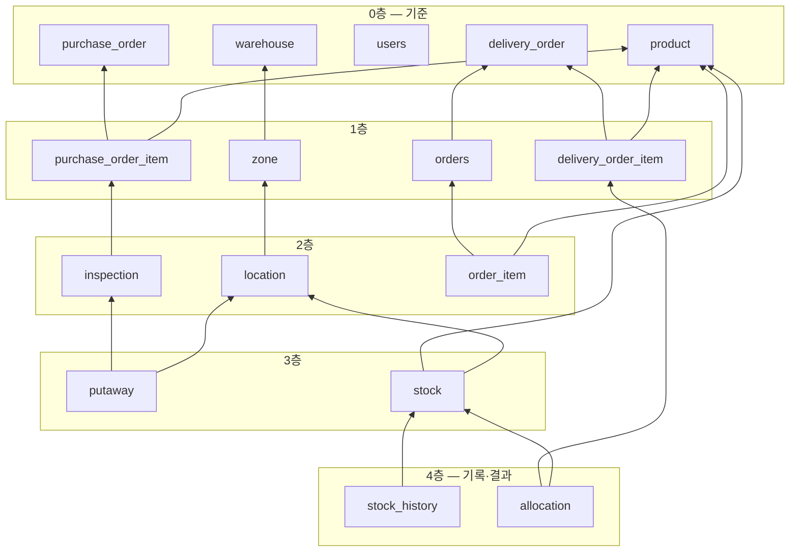

> 상위: [[KDT1차 정규프로젝트 MOC]]

# WMS 주말 MVP 명세 v2 — 단일 WMS (화주 도입 전)

> 기간: 9/19(토) ~ 9/20(일) · 범위: **백엔드만**, Talend API Tester로 검증
> 기준: 팀 시트 「정규프로젝트(3조)」의 기획서 1차 주요 기능 + 이번 주 설계 결정
> 첨부: `V1__init_schema.sql`, `V2__seed_master.sql`, `sample_data.sql`(개발용 샘플, 선택) — MySQL 8.0.46에서 실행·검증 완료
> 테이블·컬럼별 설계 이유: `WMS/테이블_설계_근거.md`
> 이 문서는 `WMS/주말_MVP_명세.md`(v1, 3PL 화주 기준)를 대체한다. 화주(멀티테넌시)는 이후 `tenant_id`를 추가하는 방식으로 붙인다(`WMS/설계서_v2.md`)

---

## 0. 한눈에

**주말 목표**: 발주 등록 → 검수 → 적치 지정 → 입고확정(재고 생성) → 주문 2건 → 출고지시로 묶기 → FEFO 할당 → 피킹 → 출고확정 → 이력 조회까지, 화면 없이 API만으로 한 바퀴 돈다(§9 시나리오 13단계).

**기획서와 다르게 정한 것**

| 기획서 | 이 명세 | 이유 |
|---|---|---|
| 로트(입고배치) 단위 관리 | **품목 + 로케이션 + 소비기한** 조합을 재고 한 행으로 관리 | 로트 번호를 따로 채번·관리하지 않아도 FEFO에 필요한 정보(소비기한)는 다 있다. 기획서 문구도 "로트" → "소비기한 단위"로 고칠 것 |
| 멀티 로케이션 분할할당은 2차 | **주말에 포함** | FEFO 알고리즘은 원래 여러 칸을 순서대로 채우는 구조라 분할이 저절로 된다. 빼는 게 더 어렵다 |
| 결품 처리는 1차 | 1차 유지, **주말에서는 제외** | 주말은 정상 흐름 한 바퀴가 목표. 2주차 첫 작업 |
| 기업 회원가입 · 직원 계정 | **주말 제외**, 인증 없이 전부 열어 둠 | Talend에서 토큰 없이 바로 호출하기 위해. 기업 회원가입은 화주(테넌트) 도입 시 함께 결정 |
| 거래처 등록·조회·수정·비활성화 | **만들지 않음.** 발주에 공급처명, 주문에 배송지를 텍스트로 | 화주 도입 후 공급처·배송처는 화주의 거래처라 창고가 관리하지 않는다. 사라질 테이블을 만들지 않는다 |
| 창고·구역 등록, 로케이션 생성 | **시드 데이터로 대체**, 조회 API만 | 기준정보 화면 없이도 입출고를 바로 시험할 수 있다 |
| 유통기한 없는 상품도 같은 스키마로 수용 | 반영: `is_expiry_managed = N`이면 소비기한을 `9999-12-31`로 저장 | 한 테이블·한 로직으로 처리되고, FEFO 정렬에서 자연히 맨 뒤로 간다 |

---

## 1. 도메인 지식 (이것만 알면 주말 작업 가능)

### 1.1 흐름

```
[입고]  발주 등록 ─▶ 검수 ─▶ 적치 지정 ─▶ 입고확정 ══▶ 재고 생성 (실물 +)
                                                        │
[출고]  주문 등록 ─▶ 출고지시(주문 묶기) ─▶ 할당(FEFO) ══▶ 선점 +
                                          ─▶ 피킹 ─▶ 출고확정 ══▶ 실물 −, 선점 −
```
`══▶` 표시가 재고 수량이 바뀌는 곳이다. **세 곳뿐이다**: 입고확정, 할당, 출고확정. 나머지 단계는 문서 상태만 바뀐다.

### 1.2 꼭 구분할 개념 (전체 용어는 `팀규칙/04_용어사전.md`)

| 개념 | 설명 |
|---|---|
| 실물 / 선점 / 가용 | 실물 = 칸에 실제로 있는 수량. 선점 = 출고하기로 찜해 둔 수량. **가용 = 실물 − 선점** = 새 출고지시가 쓸 수 있는 수량 |
| 주문 vs 출고지시 | 주문 = 배송처로 보내 달라는 요청 1건. 출고지시 = 창고가 여러 주문을 묶어 한 번에 처리하는 작업 단위. 할당·피킹·출고확정은 **출고지시 단위**로 한다 |
| FEFO | 소비기한이 빠른 재고부터 할당. 먼저 입고된 순서(FIFO)가 아니다 |
| 출고허용 잔여일 | 소비기한까지 남은 날이 이 값보다 적으면 할당하지 않는다. 생수 60일이면, 오늘이 9/19일 때 11/18 이전 기한 재고는 할당 대상이 아니다 |
| 할당 순서 vs 피킹 순서 | **무엇을 잡을지는 소비기한 순(FEFO)**, **어떤 순서로 돌지는 로케이션 코드 순**. 둘은 다르다(§9의 8·10단계) |

### 1.3 재고 수량 변화 (주말 시나리오 그대로)

생수(SKU-10001) 발주 100 → 정상 95(소비기한 2종) + 파손 5 → 주문 30 + 20 = 출고지시 50

| 시점 | A-01-01-1 (기한 2027-03-31) | A-01-02-1 (기한 2027-01-31) | 합계 실물/선점/가용 |
|---|---|---|---|
| 적치 지정까지 | 없음 | 없음 | 0 / 0 / 0 (재고는 확정 때 생김) |
| 입고확정 | 60 / 0 / 60 | 35 / 0 / 35 | 95 / 0 / 95 |
| 할당 (FEFO) | 60 / **15** / 45 | 35 / **35** / 0 | 95 / 50 / 45 |
| 피킹 | 변화 없음 | 변화 없음 | 95 / 50 / 45 |
| 출고확정 | 45 / 0 / 45 | 0 / 0 / 0 | 45 / 0 / 45 |

기한이 빠른 A-01-02-1에서 35를 전부 먼저 잡고, 부족한 15를 A-01-01-1에서 잡는다.

---

## 2. 이름 규칙

### 2.1 코드 체계

| 대상 | 형식 | 예 | 비고 |
|---|---|---|---|
| 창고 | `WH-{2자리}` | `WH-01` | 시드 1개 |
| 구역 | 영문 대문자 1자리 | `A` `B` `C` | 전부 상온. 용도로 나누지 않음 (§2.3) |
| 로케이션 | `{구역}-{통로2}-{베이2}-{단1}` | `A-01-03-2` | 통로 01~04, 베이 01~10, 단 1~3(1=바닥). 0을 채워 **문자열 정렬 = 피킹 순서** |
| 품목코드 (SKU) | `SKU-{5자리}` | `SKU-10001` | 분류·규격은 코드에 넣지 않는다(바뀔 수 있어서) |
| 발주번호 | `PO-{yyyyMMdd}-{3자리}` | `PO-20260919-001` | 그날의 일련번호 |
| 주문번호 | `ORD-{yyyyMMdd}-{3자리}` | `ORD-20260919-001` | |
| 출고지시번호 | `DO-{yyyyMMdd}-{3자리}` | `DO-20260919-001` | |
| 계정 | 관리자 `admin`, 작업자 `worker01`… | | |

> 번호는 "오늘자 마지막 번호 + 1"로 만든다. 동시에 두 건이 들어오면 같은 번호가 나올 수 있지만 UNIQUE 제약이 한쪽을 막는다. 채번 방식은 2주차 결정로그 대상이다.

```
A-01-03-2
│ │  │  └ 단 2 (아래에서 두 번째)
│ │  └──── 베이 03 (통로 안의 세 번째 칸)
│ └─────── 통로 01
└───────── 구역 A (상온, 음료)
```

### 2.2 시드 데이터 (V2)

| 구분 | 내용 | id |
|---|---|---|
| 창고 | WH-01 본 물류센터 | 1 |
| 구역 | 상온 A / B / C (각 120칸) | 1 / 2 / 3 |
| 로케이션 | A-01-01-1 ~ C-04-10-3 (360개) | A-01-01-1 = 1, A-01-01-2 = 2, **A-01-02-1 = 4** … B-01-01-1 = 121, C-04-10-3 = 360 |
| 계정 | admin (ADMIN), worker01 (WORKER) — 비밀번호 둘 다 (V2 시드 참고) (개발용) | 1, 2 |

| 품목 | 품목명 | 규격 | 단위 | 출고허용 잔여일 | 팔레트 적재수량 | 소비기한 관리 |
|---|---|---|---|---|---|---|
| SKU-10001 | 생수 | 500ml×20 | BOX | 60 | 60 | Y |
| SKU-10002 | 레몬 탄산수 | 350ml×24 | BOX | 60 | 70 | Y |
| SKU-10003 | 캔커피 | 240ml×30 | BOX | 60 | 80 | Y |
| SKU-10004 | 컵라면 매운맛 | 12입 | BOX | 90 | 40 | Y |
| SKU-10005 | 참치캔 | 150g×12 | BOX | 90 | 100 | Y |
| SKU-10006 | 즉석밥 | 210g×24 | BOX | 90 | 50 | Y |
| SKU-10007 | 종합비타민 | 90정 | EA | 180 | 2,000 | Y |
| SKU-10008 | 프로바이오틱스 | 30포 | EA | 180 | 3,000 | Y |
| SKU-10009 | 보리차 | 500ml×20 | BOX | 60 | 60 | Y |
| SKU-10010 | 종이컵 | 1000개입 | BOX | 0 | 30 | **N** |

### 2.3 로케이션·구역 크기와 쓰는 규칙

**물리 크기 (시연용 가정, 소형 상온 물류센터 규모)**

| 단위 | 크기 | 개수 |
|---|---|---|
| 로케이션 1칸 | 팔레트 랙 한 칸 = **표준 팔레트(1100×1100mm) 1장**. 적재 높이 약 1.4m, 하중 1톤 이내 | — |
| 베이 1개 | 랙 기둥 사이 한 칸을 위아래 3단으로 | 팔레트 3장 |
| 통로 1개 | 베이 10개가 한 줄 (길이 약 13m) | 팔레트 30장 |
| 구역 1개 | 통로 4개 (약 15m × 20m, 300㎡ ≈ 90평) | **팔레트 120장** |
| 창고 | 구역 3개 + 입출고장 (약 1,000㎡ ≈ 300평) | **팔레트 360장** |

**한 칸에 몇 개 들어가나**: 품목마다 다르므로 품목의 `pallet_qty`(팔레트 적재수량)로 정한다. 생수 60박스, 컵라면 40박스(부피 큼), 참치캔 100박스(작고 무거움), 종합비타민 2,000개 같은 식이다. 생수로만 A구역을 채우면 120칸 × 60 = 7,200박스.

**적치 규칙 (2주차 ST-023에서 구현, 주말에는 검사하지 않음)**

| 규칙 | 이유 |
|---|---|
| 한 칸에는 **한 품목, 한 소비기한**만 | 작업자가 같은 팔레트에서 기한을 구분해 집을 수 없다. 같은 품목·같은 기한이면 합산 가능 |
| 한 칸의 실물 합계 ≤ 그 품목의 `pallet_qty` | 넘치는 수량은 옆 칸으로 나눠 적치 (검수 행 하나를 여러 칸에 지정하는 이유) |
| 화주 도입 후: 한 칸에는 **한 화주**의 물건만 | 3PL에서 화주 물건이 섞이면 오출고가 난다 |

**구역은 화주별·품목별로 나누지 않는다 [결정]**

- 구역 이름(상온 A/B/C)은 표시일 뿐이고 **적치를 제한하지 않는다**. 어느 품목이든, 화주 도입 후에는 어느 화주든 **빈 칸이면 어느 구역에나** 적치한다.
- 이유: 화주·품목마다 구역을 고정하면, C구역 화주는 입고가 적어 칸이 비고 A구역 화주는 입고가 많아 칸이 모자라는 일이 생긴다. 빈 칸이 있는데도 입고를 못 받는 건 손해다.
- 대신 섞임은 **칸 단위 규칙**(위 표)으로 막는다.
- 기각한 대안: 화주 전용 구역 — 화주별 재고 실사와 보안이 쉬워지지만, 칸 활용률이 떨어진다. 결정로그 D-12로 남긴다.

---

## 3. 기능 요구사항 명세

기획서 1차 주요 기능을 ID로 쪼갰다. **주말** 열이 O인 것만 이번 주말에 만든다. 1차 = 2주차까지, 2차 = 여유 시.

| ID | 요구사항 | 기획서 | 단계 | 주말 | 완료 조건 |
|---|---|---|---|:-:|---|
| SYS-01 | 로그인 (JWT) | 1 | 1차 | | 아이디·비밀번호로 토큰 발급 |
| SYS-02 | 직원 계정 생성·조회·역할 변경·비활성화 | 1 | 1차 | | 관리자만 호출 가능 |
| SYS-03 | 기업 회원가입 | 1 | 보류 | | 화주(테넌트) 도입 때 함께 결정 |
| MST-01 | 품목 등록·조회 | 2 | 1차 | O | 품목코드 중복 시 409. 소비기한 관리 여부·출고허용 잔여일 저장 |
| MST-02 | ~~거래처 등록·조회·수정·비활성화~~ | 2 | **삭제** | | 거래처 테이블을 두지 않는다. 공급처명·배송지는 발주·주문에 텍스트로 (화주 도입 후 공급처·배송처는 화주의 거래처라 창고가 관리하지 않음) |
| MST-03 | 창고·구역 조회 | 2 | 1차 | O | 등록은 시드로 대체 |
| MST-04 | 로케이션 조회 (구역별, 빈 칸만) | 2 | 1차 | O | |
| MST-05 | 로케이션 일괄 생성 (구역·범위 지정) | 2 | 1차 | | 2주차. 주말은 시드 360칸 |
| IN-01 | 발주 등록·조회 | 3 | 1차 | O | 공급처명(텍스트) 필수. PO 번호 채번 |
| IN-02 | 발주 취소 | 3 | 1차 | O | 발주등록 상태에서만 |
| IN-03 | 입고 검수 (예정 vs 실제, 소비기한, 불량, 차이사유) | 3 | 1차 | O | 품목 1줄에 소비기한 여러 행. 합계 ≤ 예정, 부족하면 차이사유 필수 |
| IN-04 | 적치 로케이션 지정 | 3 | 1차 | O | 검수 행 하나를 여러 칸에 나눠 지정 가능. 합계 = 정상수량 |
| IN-05 | 입고확정 → 재고 증가 + 입고 이력 | 3 | 1차 | O | 적치 지정대로 재고 생성, `INBOUND` 이력 |
| STK-01 | 품목별 재고 조회 (실물/선점/가용) | 4 | 1차 | O | |
| STK-02 | 로케이션별 재고 조회 (한 품목의 분산 현황) | 4 | 1차 | O | 소비기한·남은 일수(D-Day) 포함 |
| STK-03 | 재고 이력 조회 | 4 | 1차 | O | 품목·유형·기간 필터 |
| STK-04 | 재고 조정 (사유 기록) | 4 | 1차 | 선택 | `ADJUST` 이력, 선점보다 작게 줄일 수 없음 |
| STK-05 | 소비기한 임박 표시 | 배경 | 1차 | O | 응답에 `daysLeft`, 30일 이하 `isImminent = true` |
| STK-06 | 안전재고 미달 표시 | 배경 | 2차 | | |
| ORD-01 | 주문 등록·조회 | 5 | 1차 | O | 배송지명·주소 필수, 연락처 선택. ORD 번호 채번 |
| ORD-02 | 주문 취소 | 5 | 1차 | O | 접수 상태에서만 |
| OUT-01 | 여러 주문을 하나의 출고지시로 묶기 | 5 | 1차 | O | 접수 상태 주문만. 묶이면 주문은 `ASSIGNED` |
| OUT-02 | 품목별 총 소요량 합산 | 5 | 1차 | O | 출고지시 품목 = 품목별 합계 |
| OUT-03 | FEFO 할당 + 선점 (가용 감소) | 5 | 1차 | O | 소비기한 빠른 순, 출고허용 잔여일 미달 제외 |
| OUT-04 | 멀티 로케이션 분할할당 | 5 | 2차→**1차** | O | 한 칸으로 부족하면 다음 칸으로 |
| OUT-05 | 재고 부족 시 거부 + 부족 수량 표시 | 5 | 2차→**1차** | O | 409, 품목별 부족 수량 반환, 선점 0 |
| OUT-06 | 출고지시 취소 → 선점 전량 해제 | 5 | 2차 | 일부 | 주말은 할당 전(`CREATED`) 취소만. 할당 후 취소는 2주차 |
| PICK-01 | 피킹 리스트 자동 생성 | 7 | 1차 | O | 할당 결과가 곧 피킹 항목 |
| PICK-02 | 로케이션 코드 순 정렬 + 순번 부여 | 7 | 1차 | O | 피킹 시작 시 `pick_seq` 부여 |
| PICK-03 | 피킹 완료 처리 | 7 | 1차 | O | 대기 → 완료. 주말은 피킹수량 = 할당수량만 허용 |
| PICK-04 | 결품 처리 → 해당 수량 선점 해제 | 7 | 1차 | | 2주차 첫 작업 |
| DOC-01 | 출고확정 → 실물·선점 차감 + 출고 이력 | 8 | 1차 | O | `OUTBOUND` 이력 |
| DOC-02 | 포함된 주문 상태 일괄 전이 (출고완료) | 8 | 1차 | O | |
| DOC-03 | 부분 출고 | 8 | 2차 | | |

**비기능 (기획서의 1차 필수 규칙)**

| ID | 규칙 | 주말 | 어떻게 지키나 |
|---|---|:-:|---|
| NFR-01 | 재고 음수 방지 | O | DB CHECK `0 ≤ 선점 ≤ 실물` + 서비스 검증 |
| NFR-02 | 출고 요청 초과 거부 | O | 가용 부족이면 할당 전체 거부 (OUT-05) |
| NFR-03 | 상태 전이 제어 | O | 엔티티 메서드에서 허용 상태 검사, 아니면 409 (§6) |
| NFR-04 | 동시 할당에서도 초과 선점 0건 | | 2주차: 비관적 락 / 조건부 UPDATE 비교 |
| NFR-05 | 이력 합계 = 현재고 | O | 재고 변경과 이력 기록을 같은 트랜잭션에서 |

---

## 4. 1차 ERD

**참조 규칙**: 외래키는 **자식(N) → 부모(1)** 한 방향만. 양방향·순환 참조 없음. MySQL에 올려 FK 17개를 검사했다(양방향 0, 순환 0).



| 영역 | 테이블 | 한 행의 의미 | 참조 (FK) |
|---|---|---|---|
| 기준 | `warehouse` | 창고 1곳 | — |
| | `zone` | 구역 1개 | warehouse |
| | `location` | 선반 한 칸 | zone |
| | `product` | 품목 1종 | — |
| | `users` | 사용자 1명 | — |
| 입고 | `purchase_order` | 발주 1건 (공급처명은 텍스트) | — |
| | `purchase_order_item` | 발주의 품목 1줄 | purchase_order, product |
| | `inspection` | 품목 1줄 안의 소비기한별 검수 결과 | purchase_order_item |
| | `putaway` | 검수 결과를 어느 칸에 몇 개 둘지 | inspection, location |
| 재고 | `stock` | 품목 × 로케이션 × 소비기한의 수량 | product, location |
| | `stock_history` | 재고 변동 1건 | stock |
| 출고 | `orders` | 주문 1건 (배송지는 텍스트) | delivery_order(묶이면) |
| | `order_item` | 주문의 품목 1줄 | orders, product |
| | `delivery_order` | 출고지시 1건 (주문 묶음) | — |
| | `delivery_order_item` | 출고지시의 품목별 합계 | delivery_order, product |
| | `allocation` | 할당 겸 피킹 항목: 품목 합계를 어느 재고 행에서 몇 개 | delivery_order_item, stock |

**설계 포인트**

- **주문 → 출고지시 방향으로만 참조**한다(`orders.delivery_order_id`). 출고지시는 주문을 참조하지 않는다. 출고지시에 속한 주문은 `WHERE delivery_order_id = ?`로 찾는다.
- **`stock_history`는 `stock_id`에만 FK**를 건다. `ref_type`·`ref_id`(발주·출고지시 번호)에 FK를 걸면 재고 → 입고·출고 방향 참조가 생겨 도메인끼리 순환한다. 값으로만 기록한다.
- **`allocation`은 로케이션·소비기한을 따로 저장하지 않는다.** `stock` 한 행의 로케이션·소비기한은 바뀌지 않으므로 조인해서 얻는다.
- **복합 UNIQUE**로 중복을 막는다: `stock(product_id, location_id, expiry_date)`, `inspection(purchase_order_item_id, expiry_date)`, `putaway(inspection_id, location_id)`, `purchase_order_item(purchase_order_id, product_id)`, `order_item(order_id, product_id)`, `delivery_order_item(delivery_order_id, product_id)`.
- **CHECK 제약**: 재고 `0 ≤ 선점 ≤ 실물`, 각 수량 > 0.
- **테이블명**: 팀 규칙대로 단수형. 예약어와 겹치는 `users`, `orders`만 복수형.

---

## 5. 데이터 설계

MySQL `information_schema`에서 뽑은 컬럼 정의다. 모든 테이블에 `created_at`, `updated_at`(DATETIME, NOT NULL)이 있으며 표에서는 생략했다(`stock_history`는 `created_at`만). UNIQUE·CHECK 제약은 §4 참고.

#### 5.1 `warehouse` — 창고

| 컬럼 | 타입 | NULL | 키 | 기본값 | 설명 |
|---|---|:-:|---|---|---|
| `id` | bigint |  | PK | AUTO |  |
| `warehouse_code` | varchar(10) |  | UQ |  | 창고코드 WH-01 |
| `warehouse_name` | varchar(50) |  |  |  | 창고명 |
| `address` | varchar(200) | O |  |  | 주소 |

#### 5.2 `zone` — 구역

| 컬럼 | 타입 | NULL | 키 | 기본값 | 설명 |
|---|---|:-:|---|---|---|
| `id` | bigint |  | PK | AUTO |  |
| `warehouse_id` | bigint |  | FK→`warehouse` |  | 창고 |
| `zone_code` | varchar(10) |  |  |  | 구역코드 A / B / C |
| `zone_name` | varchar(50) |  |  |  | 구역명 (권장 용도일 뿐, 적치를 제한하지 않음) |

#### 5.3 `location` — 로케이션 (팔레트 랙 한 칸 = 팔레트 1장)

| 컬럼 | 타입 | NULL | 키 | 기본값 | 설명 |
|---|---|:-:|---|---|---|
| `id` | bigint |  | PK | AUTO |  |
| `zone_id` | bigint |  | FK→`zone` |  | 구역 |
| `location_code` | varchar(20) |  | UQ |  | 로케이션코드 A-01-03-2 (구역-통로-베이-단). 1칸 = 표준 팔레트 1장 자리 |
| `aisle` | int |  |  |  | 통로 1~4 |
| `bay` | int |  |  |  | 베이 1~10 |
| `shelf_level` | int |  |  |  | 단 1~3 (1=바닥) |
| `is_active` | char(1) |  |  | Y | 사용여부 |

#### 5.4 `product` — 품목

| 컬럼 | 타입 | NULL | 키 | 기본값 | 설명 |
|---|---|:-:|---|---|---|
| `id` | bigint |  | PK | AUTO |  |
| `product_code` | varchar(20) |  | UQ |  | 품목코드 SKU-10001 |
| `product_name` | varchar(100) |  |  |  | 품목명 |
| `spec` | varchar(50) | O |  |  | 규격 500ml×20 |
| `unit` | varchar(10) |  |  |  | 재고 단위 EA / BOX |
| `is_expiry_managed` | char(1) |  |  | Y | 소비기한 관리 여부. N이면 소비기한을 9999-12-31로 저장 |
| `min_ship_days` | int |  |  | 0 | 출고허용 잔여일. 소비기한까지 이 일수보다 적게 남은 재고는 할당하지 않음 |
| `pallet_qty` | int |  |  |  | 팔레트 1장(= 로케이션 1칸)에 올릴 수 있는 최대 수량 |
| `safety_stock` | int |  |  | 0 | 안전재고 (2차) |
| `is_active` | char(1) |  |  | Y | 사용여부 |

#### 5.5 `users` — 사용자 (테이블명은 예약어 회피로 복수형)

| 컬럼 | 타입 | NULL | 키 | 기본값 | 설명 |
|---|---|:-:|---|---|---|
| `id` | bigint |  | PK | AUTO |  |
| `username` | varchar(50) |  | UQ |  | 로그인 아이디 |
| `password` | varchar(100) |  |  |  | BCrypt 해시 |
| `name` | varchar(50) |  |  |  | 이름 |
| `role` | varchar(20) |  |  |  | ADMIN 관리자 / WORKER 작업자 |
| `is_active` | char(1) |  |  | Y | 사용여부 |

#### 5.6 `purchase_order` — 발주 (= 입고예정)

| 컬럼 | 타입 | NULL | 키 | 기본값 | 설명 |
|---|---|:-:|---|---|---|
| `id` | bigint |  | PK | AUTO |  |
| `po_no` | varchar(30) |  | UQ |  | 발주번호 PO-20260919-001 |
| `supplier_name` | varchar(100) |  |  |  | 공급처명 (거래처 테이블 없이 텍스트) |
| `expected_date` | date |  |  |  | 입고예정일 |
| `status` | varchar(20) |  |  |  | REGISTERED / INSPECTING / PUTAWAY / COMPLETED / CANCELED |
| `remark` | varchar(200) | O |  |  | 비고 |
| `completed_at` | datetime | O |  |  | 입고확정 일시 |

#### 5.7 `purchase_order_item` — 발주 품목

| 컬럼 | 타입 | NULL | 키 | 기본값 | 설명 |
|---|---|:-:|---|---|---|
| `id` | bigint |  | PK | AUTO |  |
| `purchase_order_id` | bigint |  | FK→`purchase_order` |  | 발주 |
| `product_id` | bigint |  | FK→`product` |  | 품목 |
| `expected_qty` | int |  |  |  | 예정수량 |
| `variance_reason` | varchar(20) | O |  |  | 차이사유 NOT_ARRIVED / WRONG_ITEM / ETC (검수 합계 < 예정일 때 필수) |

#### 5.8 `inspection` — 검수 결과 (발주 품목 × 소비기한 1행)

| 컬럼 | 타입 | NULL | 키 | 기본값 | 설명 |
|---|---|:-:|---|---|---|
| `id` | bigint |  | PK | AUTO |  |
| `purchase_order_item_id` | bigint |  | FK→`purchase_order_item` |  | 발주 품목 |
| `expiry_date` | date |  |  |  | 소비기한 (관리 안 하는 품목은 9999-12-31) |
| `good_qty` | int |  |  | 0 | 정상수량 |
| `reject_qty` | int |  |  | 0 | 불량수량 |
| `reject_reason` | varchar(20) | O |  |  | DAMAGED 파손 / EXPIRY_SHORT 소비기한 부족 |

#### 5.9 `putaway` — 적치 지정 (검수 결과를 어느 칸에 몇 개 올릴지)

| 컬럼 | 타입 | NULL | 키 | 기본값 | 설명 |
|---|---|:-:|---|---|---|
| `id` | bigint |  | PK | AUTO |  |
| `inspection_id` | bigint |  | FK→`inspection` |  | 검수 결과 |
| `location_id` | bigint |  | FK→`location` |  | 적치 로케이션 |
| `qty` | int |  |  |  | 적치수량 |

#### 5.10 `stock` — 재고 (품목 × 로케이션 × 소비기한 1행)

| 컬럼 | 타입 | NULL | 키 | 기본값 | 설명 |
|---|---|:-:|---|---|---|
| `id` | bigint |  | PK | AUTO |  |
| `product_id` | bigint |  | FK→`product` |  | 품목 |
| `location_id` | bigint |  | FK→`location` |  | 로케이션 |
| `expiry_date` | date |  |  |  | 소비기한 |
| `on_hand_qty` | int |  |  | 0 | 실물재고 |
| `allocated_qty` | int |  |  | 0 | 선점재고 |
| `available_qty` | int | O |  | (생성 컬럼) | 가용재고 (생성 컬럼, 직접 쓰지 않음) |

#### 5.11 `stock_history` — 재고 이력

| 컬럼 | 타입 | NULL | 키 | 기본값 | 설명 |
|---|---|:-:|---|---|---|
| `id` | bigint |  | PK | AUTO |  |
| `stock_id` | bigint |  | FK→`stock` |  | 재고 행 |
| `product_id` | bigint |  |  |  | 품목 (복사값) |
| `location_id` | bigint |  |  |  | 로케이션 (복사값) |
| `expiry_date` | date |  |  |  | 소비기한 (복사값) |
| `tx_type` | varchar(20) |  |  |  | INBOUND / ALLOCATE / DEALLOCATE / SHORTAGE / OUTBOUND / ADJUST |
| `on_hand_delta` | int |  |  |  | 실물 증감 |
| `allocated_delta` | int |  |  |  | 선점 증감 |
| `on_hand_after` | int |  |  |  | 변경 후 실물 |
| `allocated_after` | int |  |  |  | 변경 후 선점 |
| `ref_type` | varchar(20) |  |  |  | PURCHASE_ORDER / DELIVERY_ORDER / ADJUSTMENT |
| `ref_id` | bigint | O |  |  | 근거 문서 id (조정은 NULL) |
| `reason` | varchar(200) | O |  |  | 사유 (조정·결품 필수) |
| `created_by` | varchar(50) | O |  |  | 처리자 |

#### 5.12 `orders` — 주문 (테이블명은 예약어 회피로 복수형)

| 컬럼 | 타입 | NULL | 키 | 기본값 | 설명 |
|---|---|:-:|---|---|---|
| `id` | bigint |  | PK | AUTO |  |
| `order_no` | varchar(30) |  | UQ |  | 주문번호 ORD-20260919-001 |
| `ship_to_name` | varchar(100) |  |  |  | 배송지명 (받는 곳) |
| `ship_to_address` | varchar(200) |  |  |  | 배송지 주소 |
| `ship_to_phone` | varchar(20) | O |  |  | 배송지 연락처 |
| `requested_date` | date |  |  |  | 출고요청일 |
| `status` | varchar(20) |  |  |  | RECEIVED / ASSIGNED / SHIPPED / CANCELED |
| `delivery_order_id` | bigint | O | FK→`delivery_order` |  | 묶인 출고지시. 접수 상태면 NULL |

#### 5.13 `order_item` — 주문 품목

| 컬럼 | 타입 | NULL | 키 | 기본값 | 설명 |
|---|---|:-:|---|---|---|
| `id` | bigint |  | PK | AUTO |  |
| `order_id` | bigint |  | FK→`orders` |  | 주문 |
| `product_id` | bigint |  | FK→`product` |  | 품목 |
| `qty` | int |  |  |  | 주문수량 |

#### 5.14 `delivery_order` — 출고지시 (여러 주문의 묶음)

| 컬럼 | 타입 | NULL | 키 | 기본값 | 설명 |
|---|---|:-:|---|---|---|
| `id` | bigint |  | PK | AUTO |  |
| `do_no` | varchar(30) |  | UQ |  | 출고지시번호 DO-20260919-001 |
| `status` | varchar(20) |  |  |  | CREATED / ALLOCATED / PICKING / PICKED / SHIPPED / CANCELED |
| `allocated_at` | datetime | O |  |  | 할당 일시 |
| `shipped_at` | datetime | O |  |  | 출고확정 일시 |

#### 5.15 `delivery_order_item` — 출고지시 품목 (품목별 합산)

| 컬럼 | 타입 | NULL | 키 | 기본값 | 설명 |
|---|---|:-:|---|---|---|
| `id` | bigint |  | PK | AUTO |  |
| `delivery_order_id` | bigint |  | FK→`delivery_order` |  | 출고지시 |
| `product_id` | bigint |  | FK→`product` |  | 품목 |
| `required_qty` | int |  |  |  | 총 소요량 (묶인 주문들의 합) |
| `allocated_qty` | int |  |  | 0 | 할당수량 |
| `shipped_qty` | int |  |  | 0 | 출고수량 |

#### 5.16 `allocation` — 할당 겸 피킹 항목 (출고지시 품목 × 재고 행 1행)

| 컬럼 | 타입 | NULL | 키 | 기본값 | 설명 |
|---|---|:-:|---|---|---|
| `id` | bigint |  | PK | AUTO |  |
| `delivery_order_item_id` | bigint |  | FK→`delivery_order_item` |  | 출고지시 품목 |
| `stock_id` | bigint |  | FK→`stock` |  | 할당된 재고 행 (로케이션·소비기한은 stock 조인) |
| `allocated_qty` | int |  |  |  | 할당수량 |
| `pick_seq` | int | O |  |  | 피킹 순번 (피킹 시작 시 로케이션 코드 순으로 부여) |
| `picked_qty` | int | O |  |  | 피킹수량 (입력 전 NULL) |
| `short_qty` | int |  |  | 0 | 결품수량 (2차) |
| `short_reason` | varchar(30) | O |  |  | 결품사유 (2차) |
| `status` | varchar(20) |  |  |  | WAITING 대기 / PICKED 완료 / SHORT 결품 / CANCELED 취소 |

---

## 6. 상태 전이

### 6.1 발주 `PurchaseOrderStatus`

```
REGISTERED ──검수 저장──▶ INSPECTING ──적치 지정 저장──▶ PUTAWAY ──입고확정──▶ COMPLETED
    │                         (재저장 가능)                (재저장 가능)
    └──취소──▶ CANCELED
```

| 현재 | 허용되는 요청 | 그 외 요청 |
|---|---|---|
| `REGISTERED` (발주등록 = 입고예정) | 검수 저장, 취소 | 409 `PO_001` |
| `INSPECTING` (검수중) | 검수 재저장, 적치 지정 저장 | 409 |
| `PUTAWAY` (적치중) | 적치 지정 재저장, 입고확정 | 검수 수정 → 409 (적치를 먼저 지우는 기능은 2차) |
| `COMPLETED` (입고완료), `CANCELED` | — | 모두 409 |

기획서의 "발주등록 → 입고예정"은 발주처에 확정을 받는 절차가 없으므로 한 상태(`REGISTERED`)로 합쳤다.

### 6.2 주문 `OrderStatus`

```
RECEIVED ──출고지시에 묶임──▶ ASSIGNED ──출고확정──▶ SHIPPED
   │  ▲                          │
   │  └──── 출고지시 취소 ────────┘
   └──취소──▶ CANCELED
```

### 6.3 출고지시 `DeliveryOrderStatus`

```
CREATED ──할당──▶ ALLOCATED ──피킹 시작──▶ PICKING ──모든 항목 완료──▶ PICKED ──출고확정──▶ SHIPPED
   │ (할당 실패 시 CREATED 유지)
   └──취소──▶ CANCELED   (주말: CREATED에서만. ALLOCATED 취소 = 선점 해제는 2주차)
```

### 6.4 할당 겸 피킹 항목 `AllocationStatus`

`WAITING`(대기) → `PICKED`(완료) · 2주차: `WAITING` → `SHORT`(결품), 출고지시 취소 시 `CANCELED`

---

## 7. 정책과 검증 규칙

### 7.1 입고

| 규칙 | 실패 시 |
|---|---|
| 공급처명 필수 | 400 |
| 품목은 1줄 이상, 같은 품목 중복 불가, 예정수량 ≥ 1 | 400 |
| 검수: 품목 1줄의 `Σ(정상 + 불량) ≤ 예정수량` | 400 `PO_002` |
| 검수: 합계 < 예정이면 그 줄의 차이사유 필수 (`NOT_ARRIVED` / `WRONG_ITEM` / `ETC`) | 400 `PO_005` |
| 검수: 불량 > 0이면 불량사유 필수 (`DAMAGED` / `EXPIRY_SHORT`) | 400 |
| 검수: 소비기한 관리 품목은 소비기한 필수, 오늘 이후 | 400 `PO_003` |
| 검수: 소비기한 관리 안 하는 품목은 소비기한을 비워 보내고 서버가 `9999-12-31`로 저장 | — |
| 적치: 로케이션 코드가 존재하고 사용 중이어야 한다 | 400 `LOCATION_001` |
| 적치: 한 칸 = 한 품목·한 소비기한, 칸 합계 ≤ `pallet_qty` (**2주차**, §2.3) | 400 `PO_006` |
| 입고확정: 검수 행마다 `Σ 적치수량 = 정상수량` | 400 `PO_004` |
| 입고확정: 적치 행마다 재고 생성(같은 칸·같은 소비기한이면 합산) + `INBOUND` 이력 | — |

### 7.2 출고

| 규칙 | 실패 시 |
|---|---|
| 배송지명·배송지 주소 필수 | 400 |
| 출고지시 생성: 주문 1건 이상, 전부 `RECEIVED` | 409 `ORDER_002` |
| 출고지시 품목 = 묶인 주문들의 품목별 합계 | — |
| **할당 대상 재고**: 같은 품목 AND 가용 > 0 AND `소비기한 ≥ 오늘 + 출고허용 잔여일` | — |
| **할당 순서 (FEFO)**: `소비기한 오름차순 → 로케이션 코드 오름차순` | — |
| **분할**: 순서대로 `min(가용, 남은 수량)`씩 채운다 | — |
| **부족 시**: 한 품목이라도 부족하면 전체 롤백. 선점 0, 상태는 `CREATED` 유지, 응답에 품목별 부족 수량 | 409 `STOCK_001` |
| 품목이 여러 개면 `product_id` 오름차순으로 처리 (2주차 락 순서 대비) | — |
| 피킹 시작: 할당 항목을 `로케이션 코드` 순으로 정렬해 `pick_seq` 1, 2, 3… 부여 | — |
| 피킹 완료 입력: **주말 한정** 피킹수량 = 할당수량 | 400 `DO_002` "결품 처리는 2주차에 지원" |
| 모든 항목이 완료되면 출고지시 `PICKED` | — |
| 출고확정: 항목마다 실물·선점을 피킹수량만큼 차감 + `OUTBOUND` 이력, 묶인 주문 전부 `SHIPPED` | — |

### 7.3 재고를 바꾸는 유일한 창구: `StockService` (③ 소유)

`stock` 테이블을 바꾸는 코드는 여기에만 둔다. 입고(④)와 출고(①)는 이 메서드만 호출한다.

```java
public interface StockService {
    // 입고확정: 칸·소비기한이 같은 행이 있으면 합산, 없으면 생성 + INBOUND 이력
    void receive(Long productId, Long locationId, LocalDate expiryDate, int qty, Long purchaseOrderId);

    // FEFO 후보 (주말: 락 없음 / 2주차: FOR UPDATE)
    List<Stock> findAllocatable(Long productId, LocalDate minExpiryDate);

    // 선점 + ALLOCATE 이력
    void allocate(Long stockId, int qty, Long deliveryOrderId);

    // 실물·선점 동시 차감 + OUTBOUND 이력
    void ship(Long stockId, int qty, Long deliveryOrderId);

    // (선택) 재고 조정 + ADJUST 이력
    void adjust(Long stockId, int delta, String reason);
}
```

FEFO 후보 조회 JPQL:
```java
@Query("""
    select s from Stock s join fetch s.location l
     where s.product.id = :productId
       and s.availableQty > 0
       and s.expiryDate >= :minExpiryDate
     order by s.expiryDate asc, l.locationCode asc
    """)
List<Stock> findAllocatable(@Param("productId") Long productId, @Param("minExpiryDate") LocalDate minExpiryDate);
```

### 7.4 에러 코드

| 코드 | HTTP | 메시지 |
|---|---|---|
| `PRODUCT_001` / `LOCATION_001` | 400 | 존재하지 않는 품목 / 로케이션입니다 |
| `PRODUCT_002` | 409 | 이미 등록된 품목코드입니다 |
| `PO_001` / `ORDER_001` / `DO_001` | 409 | 현재 상태에서는 처리할 수 없습니다 |
| `PO_002` | 400 | 검수 합계가 예정수량을 초과합니다 |
| `PO_003` | 400 | 소비기한이 올바르지 않습니다 |
| `PO_004` | 400 | 적치 수량 합계가 정상수량과 다릅니다 |
| `PO_005` | 400 | 예정수량과 차이가 있으면 차이사유를 입력하세요 |
| `ORDER_002` | 409 | 접수 상태의 주문만 출고지시로 묶을 수 있습니다 |
| `DO_002` | 400 | 결품 처리는 2주차에 지원합니다 |
| `STOCK_001` | 409 | 가용재고가 부족합니다 (data에 품목별 부족 수량) |

---

## 8. 주말에 만들 API (29개)

- 공통: 접두 `/api/v1`, 팀 공통 응답 래퍼 `{ success, data, message, code }`
- **주말에는 인증 없이 전부 연다** (Spring Security `permitAll`)
- 요청에는 id 대신 **코드**(`productCode`, `locationCode`)를 받는다. Talend에서 손으로 넣기 쉽다. 응답에는 id와 코드를 둘 다 준다

| # | 기능 | 메서드 | URL | 요구사항 | 담당 |
|---|---|---|---|---|---|
| A1 | 창고 목록 | GET | `/warehouses` | MST-03 | ② |
| A2 | 구역 목록 | GET | `/zones` | MST-03 | ② |
| A3 | 로케이션 목록 | GET | `/locations?zoneCode=A&empty=true` | MST-04 | ② |
| A4 | 품목 등록 | POST | `/products` | MST-01 | ② |
| A5 | 품목 목록 | GET | `/products?keyword=` | MST-01 | ② |
| A6 | 품목 상세 | GET | `/products/{id}` | MST-01 | ② |
| C1 | 발주 등록 | POST | `/purchase-orders` | IN-01 | ④ |
| C2 | 발주 목록 | GET | `/purchase-orders?status=&from=&to=` | IN-01 | ④ |
| C3 | 발주 상세 (품목·검수·적치 포함) | GET | `/purchase-orders/{id}` | IN-01 | ④ |
| C4 | 발주 취소 | PATCH | `/purchase-orders/{id}/cancel` | IN-02 | ④ |
| C5 | 검수 저장 (전체 교체) | PUT | `/purchase-orders/{id}/inspections` | IN-03 | ④ |
| C6 | 적치 지정 저장 (전체 교체) | PUT | `/purchase-orders/{id}/putaways` | IN-04 | ④ |
| C7 | 입고확정 | PATCH | `/purchase-orders/{id}/confirm` | IN-05 | ④ |
| D1 | 재고 목록 (로케이션·소비기한별) | GET | `/stocks?productCode=&locationCode=` | STK-02, 05 | ③ |
| D2 | 재고 요약 (품목별 실물/선점/가용) | GET | `/stocks/summary?keyword=` | STK-01 | ③ |
| D3 | 재고 이력 | GET | `/stock-histories?productCode=&txType=&from=&to=` | STK-03 | ③ |
| D4 | 재고 조정 (선택) | POST | `/stock-adjustments` | STK-04 | ③ |
| E1 | 주문 등록 | POST | `/orders` | ORD-01 | ① |
| E2 | 주문 목록 | GET | `/orders?status=` | ORD-01 | ① |
| E3 | 주문 상세 | GET | `/orders/{id}` | ORD-01 | ① |
| E4 | 주문 취소 | PATCH | `/orders/{id}/cancel` | ORD-02 | ① |
| F1 | 출고지시 생성 (주문 묶기) | POST | `/delivery-orders` | OUT-01, 02 | ① |
| F2 | 출고지시 목록 | GET | `/delivery-orders?status=` | | ① |
| F3 | 출고지시 상세 (주문·품목·할당 포함) | GET | `/delivery-orders/{id}` | | ① |
| F4 | 할당 (FEFO) | PATCH | `/delivery-orders/{id}/allocate` | OUT-03~05 | ① |
| F5 | 출고지시 취소 (주말: 할당 전만) | PATCH | `/delivery-orders/{id}/cancel` | OUT-06 | ① |
| F6 | 피킹 시작 (순번 부여) | PATCH | `/delivery-orders/{id}/start-picking` | PICK-02 | ① |
| F7 | 피킹 리스트 | GET | `/delivery-orders/{id}/pick-list` | PICK-01, 02 | ① |
| F8 | 피킹 완료 입력 | PATCH | `/allocations/{id}/pick` | PICK-03 | ① |
| F9 | 출고확정 | PATCH | `/delivery-orders/{id}/confirm-shipment` | DOC-01, 02 | ① |

**응답 예 — 재고 목록(D1)**
```json
{ "success": true, "message": null, "data": [
  { "stockId": 2, "productCode": "SKU-10001", "productName": "생수", "locationCode": "A-01-02-1",
    "expiryDate": "2027-01-31", "daysLeft": 134, "isImminent": false,
    "onHandQty": 35, "allocatedQty": 0, "availableQty": 35 }
] }
```

**응답 예 — 할당 실패(F4, 409)**
```json
{ "success": false, "code": "STOCK_001", "message": "가용재고가 부족합니다",
  "data": { "shortages": [ { "productCode": "SKU-10001", "requiredQty": 200, "availableQty": 45, "shortQty": 155 } ] } }
```

---

## 9. Talend API Tester 시나리오 (완료 판정)

`Content-Type: application/json`, 기본 URL `http://localhost:8080/api/v1`. **빈 DB(V1·V2만 적용)에서 9/19에 실행한 기준**이다.

| # | 요청 | 본문 | 기대 결과 |
|---|---|---|---|
| 1 | `POST /purchase-orders` | ① | 201, `poNo: PO-20260919-001`, `REGISTERED`, 품목 id 1 |
| 2 | `PUT /purchase-orders/1/inspections` | ② | 200, `INSPECTING`, 검수 id 1·2 |
| 3 | `PUT /purchase-orders/1/putaways` | ③ | 200, `PUTAWAY`. `GET /stocks` → **빈 목록** (재고는 확정 때 생김) |
| 4 | `PATCH /purchase-orders/1/confirm` | — | 200, `COMPLETED` |
| 5 | `GET /stocks?productCode=SKU-10001`, `GET /stocks/summary` | — | A-01-01-1 60(2027-03-31), A-01-02-1 35(2027-01-31) / 요약 실물 95, 선점 0, 가용 95 |
| 6 | `POST /orders` 두 번 | ④, ⑤ | `ORD-20260919-001`(30), `ORD-20260919-002`(20), 둘 다 `RECEIVED` |
| 7 | `POST /delivery-orders` | `{"orderIds":[1,2]}` | 201, `DO-20260919-001`, `CREATED`, 품목 SKU-10001 소요량 **50**. 주문 2건 `ASSIGNED` |
| 8 | `PATCH /delivery-orders/1/allocate` | — | `ALLOCATED`. 할당 id 1: **A-01-02-1 35** (기한 빠름), id 2: **A-01-01-1 15**. 요약 95 / 50 / 45 |
| 9 | `PATCH /delivery-orders/1/start-picking` | — | `PICKING` |
| 10 | `GET /delivery-orders/1/pick-list` | — | 순번 1: **A-01-01-1** 15 (할당 id 2), 순번 2: A-01-02-1 35 (할당 id 1). 할당은 기한 순, 피킹은 칸 순 |
| 11 | `PATCH /allocations/2/pick`, `PATCH /allocations/1/pick` | `{"pickedQty":15}`, `{"pickedQty":35}` | 두 번째 호출 뒤 출고지시 `PICKED` |
| 12 | `PATCH /delivery-orders/1/confirm-shipment` | — | `SHIPPED`, 주문 2건 `SHIPPED`. 요약 45 / 0 / 45 |
| 13 | `GET /stock-histories?productCode=SKU-10001` | — | 6건: INBOUND +60·+35, ALLOCATE 35·15, OUTBOUND −35·−15. **실물 증감 합 = 45 = 현재 실물** |

**본문**
```json
// ① 발주 등록
{ "supplierName": "맑은샘음료", "expectedDate": "2026-09-21", "remark": "정기 발주",
  "items": [ { "productCode": "SKU-10001", "expectedQty": 100 } ] }

// ② 검수 저장 (itemId는 1단계 응답의 품목 id)
{ "items": [ { "itemId": 1, "varianceReason": null,
    "rows": [
      { "expiryDate": "2027-03-31", "goodQty": 60, "rejectQty": 0 },
      { "expiryDate": "2027-01-31", "goodQty": 35, "rejectQty": 5, "rejectReason": "DAMAGED" } ] } ] }

// ③ 적치 지정 (inspectionId는 2단계 응답의 검수 id)
{ "rows": [
    { "inspectionId": 1, "locationCode": "A-01-01-1", "qty": 60 },
    { "inspectionId": 2, "locationCode": "A-01-02-1", "qty": 35 } ] }

// ④ 주문 1
{ "shipToName": "바른마트 강남점", "shipToAddress": "서울시 강남구 테헤란로 1", "shipToPhone": "02-100-0001",
  "requestedDate": "2026-09-22",
  "items": [ { "productCode": "SKU-10001", "qty": 30 } ] }

// ⑤ 주문 2
{ "shipToName": "바른마트 판교점", "shipToAddress": "경기도 성남시 분당구 판교로 2", "shipToPhone": null,
  "requestedDate": "2026-09-22",
  "items": [ { "productCode": "SKU-10001", "qty": 20 } ] }
```

**실패 확인 (여유 있으면)**

| # | 요청 | 기대 결과 |
|---|---|---|
| F1 | ② 본문의 60을 70으로 (70 + 35 + 5 = 110 > 100) | 400 `PO_002` |
| F2 | ③ 본문의 60을 50으로 하고 확정 | 400 `PO_004` (정상 60 ≠ 적치 50) |
| F3 | ① 본문의 `items`를 빈 배열로 | 400 |
| F4 | 12단계 후 주문 200 등록 → 출고지시 생성 → 할당 | 409 `STOCK_001`, `shortQty: 155`, 선점 변화 없음. 이어서 `PATCH /delivery-orders/2/cancel` → 주문이 `RECEIVED`로 복귀 |
| F5 | 이미 `SHIPPED`인 주문 1로 출고지시 생성 | 409 `ORDER_002` |
| F6 | 종이컵(SKU-10010) 발주 → 검수에서 `expiryDate` 생략 | 200, 재고 소비기한 `9999-12-31` |
| F7 | 할당 id 1에 `pickedQty: 30` | 400 `DO_002` |

---

## 10. 기초 JPA 외에 주말 전에 알아야 할 것 (전원 필독)

기초 JPA(Entity, DTO `from`/`toEntity`, Repository, `@Transactional`)로 대부분 만들 수 있다. 아래 여섯 가지만 추가로 알고 시작한다.

**1. 수정은 `toEntity()`가 아니라 "찾아서 → 엔티티 메서드 호출"**
```java
public void confirm() {                        // 엔티티
    if (status != PurchaseOrderStatus.PUTAWAY) throw new BusinessException(ErrorCode.PO_001);
    this.status = PurchaseOrderStatus.COMPLETED;
    this.completedAt = LocalDateTime.now();
}

@Transactional                                 // 서비스
public void confirm(Long id) {
    PurchaseOrder po = purchaseOrderRepository.findById(id).orElseThrow(...);
    // 검증 → putaway 행마다 stockService.receive(...) 호출
    po.confirm();                              // save() 없이도 트랜잭션 끝에 UPDATE (변경 감지)
}
```
`@Setter` 금지(팀 규칙). 상태 규칙은 엔티티 메서드 안에 둔다.

**2. `toEntity()`는 자기 필드만. 코드로 다른 테이블을 찾는 일은 서비스에서**
`productRepository.findByProductCode()`, `locationRepository.findByLocationCode()`로 찾아 엔티티에 넘긴다.

**3. 연관관계는 FK가 있는 쪽의 `@ManyToOne(fetch = LAZY)`만**
부모에 `@OneToMany`를 두지 않는다(DB 참조 방향과 같게). 부모 `save()` 후 자식을 각자 Repository로 `save()`, 상세는 `findByPurchaseOrderId(id)`로 조회한다.

**4. enum은 반드시 `@Enumerated(EnumType.STRING)`**
기본값(ORDINAL)은 숫자로 저장돼 enum 순서를 바꾸면 데이터가 뒤바뀐다.

**5. 생성 컬럼 `available_qty` 매핑**
```java
@Column(insertable = false, updatable = false)
private int availableQty;          // 조회 쿼리 조건용. DB가 계산

public int available() { return onHandQty - allocatedQty; }   // 자바 코드에서는 이것만 쓴다
```
같은 트랜잭션에서 선점을 바꾼 직후 `availableQty` 필드는 옛 값이다.

**6. 여러 테이블을 바꾸는 서비스 메서드에 `@Transactional`**
입고확정은 `purchase_order`, `stock`, `stock_history`를 함께 바꾼다. 중간에 예외가 나면 전부 롤백돼야 한다.

**주말에 배우지 않아도 되는 것**: 락(`@Lock`, `@Modifying`), 동시성 테스트, Testcontainers, `@OneToMany` cascade, fetch join 튜닝, Spring Security JWT 적용, Excel(POI), RabbitMQ, 멀티테넌시.

---

## 11. 담당별 주말 할 일

### 금요일 밤 ~ 토요일 오전 (선행)

| 담당 | 할 일 | 마감 |
|---|---|---|
| ② | 뼈대 리포, docker-compose(MySQL 8), Flyway에 V1·V2, `BaseEntity`, 공통 응답·예외 핸들러, Swagger, `permitAll`, 계정은 V2 시드에 포함(admin / worker01, (V2 시드 참고)), 채번 유틸 | 토 10시 |
| ③ | `Stock`, `StockHistory` 엔티티 + `StockService` 인터페이스와 빈 구현 push | 토 11시 |
| 전원 | clone → 실행 → `GET /api/v1/warehouses` 확인 | 토 11시 |

### 토·일

| 담당 | API | 엔티티 | 완료 기준 |
|---|---|---|---|
| **① 출고** | E1~E4, F1~F9 (13개) | `Order`, `OrderItem`, `DeliveryOrder`, `DeliveryOrderItem`, `Allocation`, `FefoAllocationPlanner` | 시나리오 6~12 + F4·F5·F7 |
| **② 나** | A1~A6 (6개) + 병합 | `Warehouse`, `Zone`, `Location`, `Product` | 시나리오 전체 1회 통과 (일 저녁) |
| **③ 재고** | D1~D4 (4개) + `StockService` + ④ 지원 | `Stock`, `StockHistory` | 5·13단계, 이력 합 = 현재고 |
| **④ 입고** | C1~C7 (7개) | `PurchaseOrder`, `PurchaseOrderItem`, `Inspection`, `Putaway` | 1~4단계 + F1~F3 |

- **①은 ④를 기다리지 않는다.** 토요일에는 재고를 SQL로 넣고 개발한다.
  ```sql
  INSERT INTO stock (product_id, location_id, expiry_date, on_hand_qty, allocated_qty, created_at, updated_at) VALUES
  (1, 1, '2027-03-31', 60, 0, NOW(), NOW()),   -- A-01-01-1
  (1, 4, '2027-01-31', 35, 0, NOW(), NOW());   -- A-01-02-1
  ```
- **④는 C7(입고확정)을 일요일 12시까지 못 끝내면 ③과 페어로 한다.** C1~C6이 ④의 필수 범위다.
- 병합 순서(일 18시): ② → ③ → ④ → ①. 병합 후 빈 DB에서 §9를 처음부터 한 번 돌린다.

**`FefoAllocationPlanner` (①) — DB 없이 도는 순수 자바**
```java
public AllocationPlan plan(List<Stock> candidates, int requiredQty) {
    List<AllocationPlan.Item> items = new ArrayList<>();
    int remaining = requiredQty;
    for (Stock s : candidates) {                    // 이미 소비기한 → 로케이션 순으로 정렬돼 있음
        if (remaining == 0) break;
        int take = Math.min(s.available(), remaining);
        if (take > 0) { items.add(new AllocationPlan.Item(s.getId(), take)); remaining -= take; }
    }
    return remaining == 0 ? AllocationPlan.success(items) : AllocationPlan.shortage(requiredQty - remaining);
}
```
한 품목이라도 `shortage`면 아무것도 선점하지 않고 409를 던진다(`@Transactional` 롤백).

---

## 12. 일요일 밤 체크리스트

- [ ] 빈 DB에서 §9의 1~13단계가 처음부터 끝까지 통과한다
- [ ] 13단계의 실물 증감 합이 12단계의 현재 실물과 같다
- [ ] `stock` 테이블을 바꾸는 코드가 `StockService` 밖에 없다
- [ ] 모든 enum이 `EnumType.STRING`, 모든 연관관계가 `@ManyToOne(LAZY)` 단방향이다
- [ ] 코드에 쓴 이름이 `팀규칙/04_용어사전.md`와 같다 (다르면 사전 먼저 고치기)
- [ ] 월요일 구두 설명: 각자 "내 API가 재고를 어떻게 바꾸는지(또는 안 바꾸는지)" 1분

## 13. 다음 단계 (참고)

| 시점 | 할 일 |
|---|---|
| 2주차 초 | 결품(PICK-04), 할당 후 출고지시 취소(OUT-06), 로그인·계정(SYS-01·02), 로케이션 일괄 생성(MST-05) |
| 2주차 중 | 동시 할당 재현 테스트 → 비관적 락 / 조건부 UPDATE 비교 (NFR-04) |
| 화주 도입 시 | `V3__add_tenant.sql`: `tenant` 테이블 추가, `product`·`stock`·`purchase_order`·`orders`·`delivery_order`에 `tenant_id` 추가. 기존 데이터는 기본 화주 1로 채움 (`WMS/설계서_v2.md`) |
